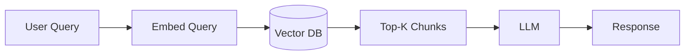
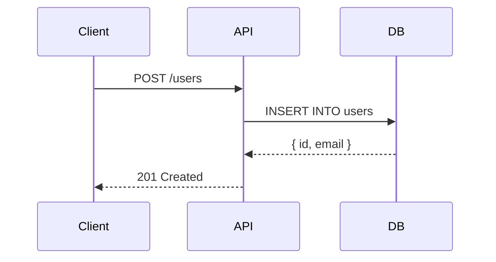

# Diagrams

This folder is a placeholder for architecture diagrams and visual references.

## Planned Diagrams

### Full Stack

- `react-rendering-lifecycle.png` — Component lifecycle: mount → update → unmount with hooks
- `nextjs-app-router.png` — Server components vs client components, data flow
- `rest-api-request-flow.png` — Request → middleware → validation → handler → DB → response

### AI / ML

- `transformer-architecture.png` — Encoder/decoder, attention heads, positional encoding
- `rag-pipeline.png` — Query → embed → vector search → prompt assembly → LLM → response
- `ml-training-pipeline.png` — Data ingestion → feature engineering → train → eval → deploy

### Data Engineering

- `star-schema.png` — Fact table + dimension tables layout
- `kafka-consumer-groups.png` — Topics, partitions, consumer group offsets
- `etl-vs-elt.png` — Traditional ETL vs modern ELT with cloud warehouse

## Tools for Creating Diagrams

- [Excalidraw](https://excalidraw.com) — Hand-drawn style, great for architecture sketches
- [draw.io](https://draw.io) — More formal, has AWS/GCP/Azure icon libraries
- [Mermaid](https://mermaid.js.org) — Diagram-as-code, renders in GitHub Markdown

## Mermaid Quick Reference

Paste these in any Markdown file to render diagrams in GitHub/VS Code with the Mermaid extension:

### Flowchart

### Sequence Diagram

